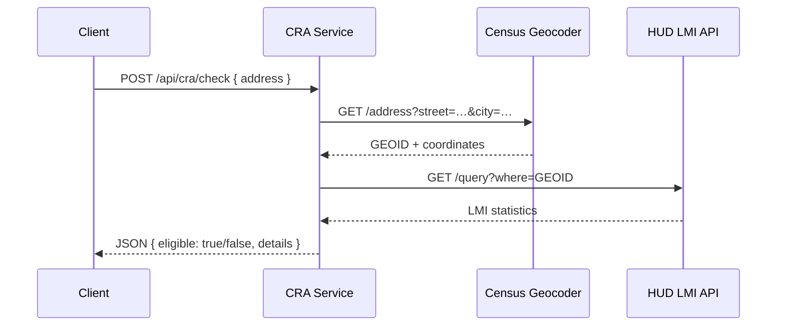

# CRA Eligibility Address Checker

A lightweight web API that tells you whether a given US address is located in a **Low-to-Moderate-Income (LMI) census tract** and therefore qualifies under the **Community Reinvestment Act (CRA)**.

## How It Works (business-level)
1. You send an address in the following format:
```json
{
  "address": {
    "street": "1600 Amphitheatre Parkway",
    "city": "Mountain View",
    "state": "CA",
    "zip": "94043"  // optional
  }
}
```
2. The service asks the **US Census Geocoder API** for the matching census tract (GEOID) -> [Here the documentation]( https://geocoding.geo.census.gov/geocoder/Geocoding_Services_API.html)
3. Using that GEOID, it fetches LMI statistics from the **HUD ArcGIS LMI dataset**. (US Department of Housing and Urban Development) -> [Here the documentation](https://services.arcgis.com/VTyQ9soqVukalItT/arcgis/rest/services/Low_to_Moderate_Income_Population_by_Tract/FeatureServer/4/query)
4. If ≥ 51 % of residents in the tract are low/moderate income, the address is CRA-eligible.



## API Documentation

### REST Endpoints
| Method | Path              | Purpose |
| ------ | ----------------- | ------- |
| GET    | `/api/cra/health` | Service heartbeat |
| POST   | `/api/cra/check`  | CRA eligibility check |

### POST /api/cra/check

This endpoint checks if a given US address is located in a Low-to-Moderate-Income (LMI) census tract and therefore qualifies under the Community Reinvestment Act (CRA).

#### Request
curl example:
```bash
curl -X POST http://localhost:5000/api/cra/check \
-H "Content-Type: application/json" \
-d '{"address": {"street": "1600 Amphitheatre Parkway", "city": "Mountain View", "state": "CA", "zip": "94043"}}'
```

#### Response
```json
{
    "eligible": true,
    "address": {
        "street": "1600 Amphitheatre Parkway",
        "city": "Mountain View",
        "state": "CA"
    },
    "census_tract": {
        "geoid": "06085504601",
        "name": "Census Tract 5046.01"
    },
    "lmi_data": {
        "low_mod_income_percentage": 53.01,
        "is_lmi_area": true,
        "threshold": 51,
        "low_mod_income_count": 440,
        "total_population": 830
    },
    "coordinates": {
        "latitude": 37.423120361623,
        "longitude": -122.083521249656
    },
    "matched_address": "1600 AMPHITHEATRE PKWY, MOUNTAIN VIEW, CA, 94043",
    "timestamp": "2025-06-19T14:15:55.667Z"
}
```

## Quick Start
```bash
# inside the ts-refactoring folder
npm install          # install dependencies
npm run build          # build the project
npm run start          # start the server on http://localhost:5000
```
You can play with the API using the `static/index.html` file,
just open your browser and go to http://localhost:5000.


## HUD LMI API URL 

The correct ArcGIS REST API URL from HUD for LMI data by census tract is:

https://services.arcgis.com/VTyQ9soqVukalItT/arcgis/rest/services/Low_to_Moderate_Income_Population_by_Tract/FeatureServer/4/query

Available fields include:
- GEOID: Census tract identifier
- STATE: State
- COUNTY: County
- TRACT: Census tract
- LOWMOD: Low/moderate income population
- LOWMODUNIV: Total population
- LOWMODPCT: LMI percentage
- UCLMOD: Urban LMI population
- UCLMODU: Total urban population 
- UCLMODPCT: Urban LMI percentage

Example query URL:
https://services.arcgis.com/VTyQ9soqVukalItT/arcgis/rest/services/Low_to_Moderate_Income_Population_by_Tract/FeatureServer/4/query?where=1%3D1&outFields=*&outSR=4326&f=json


## License
MIT (see LICENSE file).

